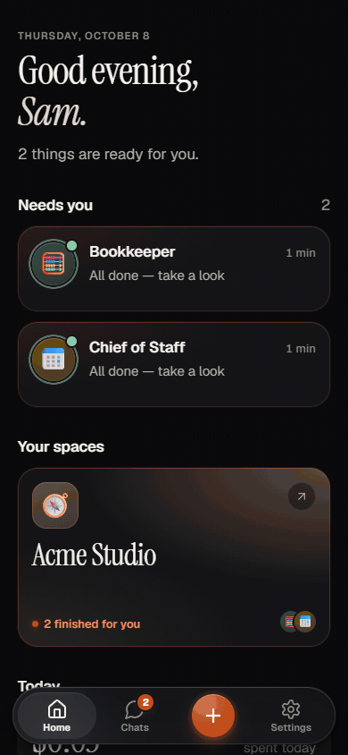
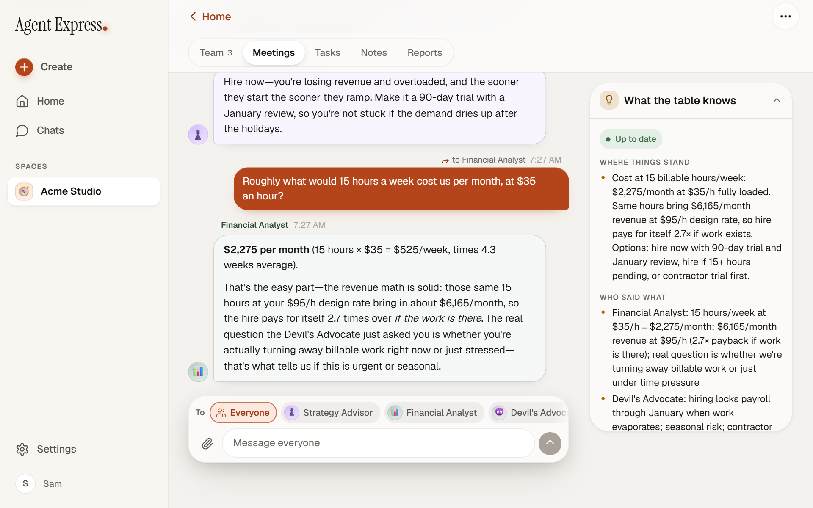

<div align="center">

# Agent Express

**A team of Claude Code agents that runs your business and your household, on your own computer,
and texts you back on your phone.**

Hire a Chief of Staff, a Bookkeeper, a Meal Planner and thirty-odd more. Message them like people,
pull a few into one conversation, and watch them work. Everything runs on your machine, on your own
Claude plan. Your phone reaches it over your private Tailscale network, from anywhere.

**Want it?** [Install in one line](#install). Your phone is [three taps after that](#on-your-phone).

[](LICENSE)
[](https://nodejs.org)
[](#requirements)
[](https://docs.claude.com/en/docs/claude-code)
[](https://tailscale.com)

</div>

---

## What it does



*Nothing here is staged. These are real Claude Code agents in a brand-new workspace, recorded from
a real Agent Express build in a phone-sized browser, start to finish in one take. Every reply is what the
agents actually wrote, and the memory sheet at the end is what Haiku actually kept. Two honest
footnotes: to keep the recording cheap every teammate ran on Haiku instead of the model in their
brief, and the stretches where they were thinking are sped up (up to 8x). The company and the
person are made up: "Acme Studio" and "Sam" don't exist.*

You open Agent Express on your phone. Your **Chief of Staff** has planned the week and your **Bookkeeper**
has the invoices ready. You open the studio's space, tap **✚ → Call a meeting**, pick the
**Strategy Advisor**, the **Financial Analyst** and the **Devil's Advocate**, and ask:

> We have more design work than I can finish. Should Acme Studio hire a part-time designer now, or
> wait until after the holidays?

They answer one by one, each from their own job: hire now, hire a contractor, measure first. Then
you tap just the **Financial Analyst** in the **To** row and ask what 15 hours a week would cost.
Only she answers, and she already knows what the other two said. **What the table knows**, a
summary Haiku rewrites after every turn, has the whole thing: where it stands, who said what, and
what's still open.

On a computer it's the same app with room to breathe:



Every teammate is a real **Claude Code** session in a real terminal on your computer. They read and
write real files in your workspace, use your installed skills and MCP tools, run commands, and
remember things in a shared `memory/` folder that every teammate reads before they answer. Agent Express
is the calm front door to all of it.

### Why not just use Claude on my phone, or Claude Code in a terminal?

They are both excellent, and Agent Express uses Claude Code for everything. What it adds is a *team*, a
place for them to live, and a way to reach them that doesn't need you at your desk.

|  | Agent Express | The Claude app on your phone | Claude Code in a terminal |
|---|---|---|---|
| **Works on** | Files, tools and commands on your own computer | Chats and uploads | Files, tools and commands on your own computer |
| **From your phone** | Yes, built for it | Yes | Not really |
| **Several agents at once** | Yes, each in its own terminal | One chat at a time | One per terminal you open |
| **Agents talk to each other** | Yes, in conversation meetings | No | Only if you script it |
| **Shared memory** | A `memory/` folder every teammate reads and writes | Per-project | Per-folder `CLAUDE.md` |
| **Cost** | Your existing Claude plan | Your existing Claude plan | Your existing Claude plan |
| **Your data** | Stays on your computer (plus what Claude Code sends Anthropic) | In the cloud | Stays on your computer (plus what Claude Code sends Anthropic) |
| **Setup** | One line, about 10 minutes | Download and sign in | Install the CLI |

---

## Highlights

- **A whole team, ready to hire.** 35 teammates in nine departments, from Leadership and
  Engineering to Home & Life and Personal Finance. Each one has a job, a brief and a sensible model:
  Opus where judgment matters, Sonnet for everyday work, Haiku for lists and reminders. Hire one, or
  a whole **crew** at once (Weekly Planning, Product Team, Monthly Money Meeting, twelve in all).
- **Text them like people.** Every teammate has a chat. Attach photos and PDFs from your phone
  (receipts, screenshots, a letter from the school). Status is in words: *Working on it*, *Needs
  you*, *Finished*.
- **Conversation meetings.** Talk to everyone at the table, or tap just the people you mean. No
  rounds, no turn-taking rules: it runs until you end it. A shared memory, kept by Haiku, keeps
  everyone on the same page, and the whole conversation is saved as a record when you're done.
- **Structured meetings too.** Debate, Lead & team, Divide & combine, Red / blue and Review panel,
  for when you want a decision written down, a big job split up, an attack-and-fix pass or a code
  review. Ask the lead follow-up questions when it's over.
- **The live terminal, when you want it.** Every chat has the real terminal behind it, with a key
  bar for your phone (Esc, Tab, the arrows, Enter, ^C, 1, 2, 3, y, n). When a teammate stops on one
  of Claude Code's own questions, the chat shows it with **Quick answers** you can tap.
- **A shared memory.** Each space keeps one `memory/` folder: a short summary of where things stand,
  dated notes and structured data. **Notes** shows it in plain words, and **Tell the team
  something** adds to it from your phone.
- **Tasks, reports, GitHub and pull requests.** Queue work and walk away. Teammates save reports
  (HTML, PNG, PDF) that open right in the app. A teammate's changes show as a diff you can commit,
  discard or turn into a pull request.
- **Bring people in.** Invite your partner, your bookkeeper or a colleague with a single-use link.
  They get their own sign-in, and they see the same team.
- **Your computer, your plan, your files.** No account with us, no server of ours, no telemetry.

---

## Requirements

|  | Minimum | Recommended |
|---|---|---|
| **OS** | Windows 10 64-bit, macOS 13, or a recent Linux | Windows 11 or macOS 14+ |
| **CPU / RAM** | Any 64-bit CPU, 8 GB | 16 GB if you run more than about five teammates at once |
| **Disk** | 2 GB for the app and its packages | SSD |
| **Claude** | A Claude plan that includes Claude Code (Pro or Max), or an Anthropic API key | Max, if you keep a big team busy |
| **Node.js** | 20 | 22 LTS |
| **Git** | Any recent version | |
| **A phone** | Optional. Any iPhone or Android with a modern browser | |
| **Tailscale** | Optional, for the phone. Free for personal use | |

The installer checks for Node.js, Git, the Claude Code CLI and Tailscale, and offers to install
whichever are missing. Your computer has to be on (and awake) for your teammates to work and for your
phone to reach them.

---

## Install

### Windows

Open **PowerShell** (press Start, type `powershell`, press Enter) and paste:

```powershell
irm https://raw.githubusercontent.com/DatafyingTech/Agent-Express/main/install.ps1 | iex
```

Or [download the ZIP](https://github.com/DatafyingTech/Agent-Express/archive/refs/heads/main.zip),
right-click it, choose **Extract All**, open the folder and double-click **`install.bat`**.

Windows may show **"Windows protected your PC"** for `install.bat`. That is SmartScreen reacting to
any script from the internet. Click **More info**, then **Run anyway**, or right-click the ZIP,
choose **Properties**, tick **Unblock** and extract it again.

### macOS and Linux

```bash
curl -fsSL https://raw.githubusercontent.com/DatafyingTech/Agent-Express/main/install.sh | bash
```

### What the installer does

Every step is skipped when it is already done, so running it again is always safe.

1. **Checks for Node.js 20+, Git, the Claude Code CLI and Tailscale**, and offers to install what's
   missing: `winget` on Windows, Homebrew on macOS, your package manager on Linux. It asks first.
2. **Checks that Claude Code is signed in**, and offers to sign you in.
3. **Installs and builds the app** (`npm ci`, `npm run build`).
4. **Creates your workspace**, `~/AgentExpress` (`%USERPROFILE%\AgentExpress` on Windows): a starter
   `CLAUDE.md` about you, a `memory/` folder and a `TODO.md`, as a git repository. It also tells
   Claude Code to trust that folder, after backing up `~/.claude.json`. Without that, the first
   teammate you hire would stop at Claude Code's "Do you trust this folder?" question, whose default
   answer is "No, exit".
5. **Sets your sign-in password.** Type your own, or press Enter for a generated one, which it shows
   you once. Only a hash is stored.
6. **Offers to start Agent Express when you sign in** (a hidden per-user task on Windows, launchd on macOS,
   a systemd user service on Linux), and adds Start Menu and desktop shortcuts on Windows.
7. **Starts Agent Express and shares it on your tailnet** with `tailscale serve`. Agent Express itself only
   listens on `127.0.0.1`, so nothing on your Wi-Fi can reach it.
8. **Prints the address to open on your phone.**

About **5 to 15 minutes**, most of it downloading packages. It tells you plainly when something is
missing and what to do about it.

<details>
<summary><b>Options</b> (port, workspace, no Tailscale, unattended, dry run)</summary>

From a downloaded copy, pass options to the installer:

```powershell
install.bat -Port 4700 -Workspace D:\MyTeam -NoAutostart
```

```bash
./install.sh --port 4700 --workspace ~/my-team --no-autostart
# or through the one-liner:
curl -fsSL https://raw.githubusercontent.com/DatafyingTech/Agent-Express/main/install.sh | bash -s -- --port 4700
```

| Windows | macOS / Linux | What it does |
|---|---|---|
| `-Port <n>` | `--port <n>` | The port on this computer (default 4600) |
| `-Workspace <dir>` | `--workspace <dir>` | Your workspace folder (default `~/AgentExpress`) |
| `-InstallDir <dir>` | `--install-dir <dir>` | Where the one-line install puts the app (default `%LOCALAPPDATA%\Programs\Agent-Express` / `~/.local/share/agent-express`) |
| `-NoTailscale` | `--no-tailscale` | This computer only: don't install, start or configure Tailscale |
| `-NoAutostart` / `-Autostart` | `--no-autostart` / `--autostart` | Don't (or do) start Agent Express when you sign in, without asking |
| `-NoShortcut`, `-NoDesktopShortcut` | | No shortcuts, or Start Menu only |
| `-NoStart` | `--no-start` | Set everything up, but don't start it |
| `-ResetPassword` | `--reset-password` | Ask for a new password even if one is set |
| `-Yes` | `-y`, `--yes` | Unattended: take the default for every question |
| `-DryRun` | `--dry-run` | Report what it would do, change nothing |
| `-Force` | `--force` | Reinstall packages and rebuild even when they look up to date |

The one-line Windows install can't take options, so it reads environment variables instead:
`AGENT_EXPRESS_PORT`, `AGENT_EXPRESS_WORKSPACE`, `AGENT_EXPRESS_INSTALL_DIR`, `AGENT_EXPRESS_YES=1`, `AGENT_EXPRESS_DRY_RUN=1`,
`AGENT_EXPRESS_NO_TAILSCALE=1`, `AGENT_EXPRESS_NO_AUTOSTART=1` and `AGENT_EXPRESS_PASSWORD`.
</details>

### The helper scripts

In the app's folder, next to the installer:

| Windows | macOS / Linux | What it does |
|---|---|---|
| `start.bat` | `./start.sh` | Start Agent Express in the background and open it |
| `stop.bat` | `./stop.sh` | Stop Agent Express and its teammates (`start` wakes them back up) |
| `doctor.bat` | `./doctor.sh` | Check everything and print a fix for each problem |
| `update.bat` | `./update.sh` | Get the newest version, rebuild and restart, keeping your settings |
| `password.bat` | `./password.sh` | Set a new sign-in password |
| `uninstall.bat` | `./uninstall.sh` | Stop it and remove the autostart, shortcuts and Tailscale share |

---

## First run

Open **http://localhost:4600** on the computer (or `start.bat` / `./start.sh`, which starts Agent Express
if it isn't running and opens it) and sign in with your password.

1. **Tell the team about yourself.** Open `CLAUDE.md` in your workspace and fill in the few lines
   about you and how you like to work. Every teammate reads it before they start.
2. **Hire someone.** Tap **✚** (the round button in the middle of the tab bar) → **Add a
   teammate**. Pick one person, a whole crew, or a general helper. Start small: a **Chief of
   Staff** and a **Personal Assistant** are a good first pair.
3. **Say hello.** Tap a teammate and send a message. The first reply takes a few seconds while
   Claude Code starts up.
4. **Call a meeting.** **✚** → **Call a meeting**, tap two or three people under **Who's coming**,
   write what it's about, and **Start the conversation**.

Your workspace is your first **space**. Add more from **Settings → Spaces → Add a space from
GitHub**: pick one of your repositories and Agent Express clones it and gives it its own team, notes and
tasks.

The [tutorial](docs/TUTORIAL.md) walks through all of this with screenshots, start to finish.

---

## On your phone

Your phone reaches Agent Express through [Tailscale](https://tailscale.com), a private network between
your own devices that works from anywhere with a signal: home Wi-Fi, LTE, a hotel. Nothing is
opened to the internet. The installer sets up the computer side; on the phone:

1. **Install Tailscale** from the App Store or Google Play, and sign in with **the same account**
   you used on the computer.
2. **Open the address the installer printed**, something like
   `http://my-pc.example-tailnet.ts.net:4600/app`, in **Safari** (iPhone) or **Chrome** (Android),
   and sign in with your password. Lost the address? `doctor.bat` / `./doctor.sh` prints it, and so
   does **Settings → About → On your phone** on the computer. Forgot the password?
   `password.bat` / `./password.sh` sets a new one.
3. **Add it to your Home Screen**, so it opens full screen like an app:
   - **iPhone:** tap **Share** (the square with an arrow), scroll down, tap **Add to Home Screen**,
     then **Add**.
   - **Android:** tap the **⋮** menu, then **Add to Home screen** (or **Install app**), then **Add**.

<details>
<summary><b>The address doesn't load on my phone</b></summary>

- Check Tailscale is **on** on the phone (the toggle in its app) and that both devices show in the
  same tailnet.
- Use the full name ending in `.ts.net`, exactly as printed. The share answers to the computer's
  Tailscale **name**, not its `100.x` address. If the name doesn't resolve, turn on **MagicDNS** in
  the Tailscale admin console (it's on by default for new tailnets).
- Is the computer asleep? It has to be awake. On a laptop, plug it in and stop it sleeping while
  plugged in.
- Run `doctor.bat` / `./doctor.sh`. Its Tailscale lines say whether the share is in place.
</details>

### Adding someone else's phone

Two steps: let their device onto your computer's network, then give them their own sign-in.

1. **Share your computer with them in Tailscale.** In the [Tailscale admin console](https://login.tailscale.com/admin/machines),
   open your computer's **⋯** menu, choose **Share…**, and send them the invite. They accept it in
   their own Tailscale app (a free account is fine). They can now reach your computer, and only your
   computer, not the rest of your tailnet. If they already are on your tailnet (a family member you
   added as a user), skip this.
2. **Invite them in Agent Express.** **Settings → People & access → Invite someone**, type their name,
   choose **Member** or **Admin**, and **Make an invite link**. Send it with **Copy link** or
   **Share…**. The link works once, for 7 days. They open it on their phone, pick their own
   password, and they're in under their own name. You can remove anyone from the same screen, and
   they're signed out at once.

Once everyone has their own account, you can switch off **Let the shared password in** on the same
screen, so only named accounts get in.

---

## Using it

| You want to | How |
|---|---|
| **Hire a teammate, or a crew** | **✚ → Add a teammate**, or a space's **⋯ → Add teammates** |
| **Message one teammate** | Tap them. Attach photos or PDFs (up to 15 MB) with the paperclip, or paste or drop them on a computer |
| **Answer a question they asked** | It shows under **Needs you** on Home. Reply in the chat, tap one of the **Quick answers**, or **Open the terminal** and use the key bar |
| **Talk to several at once** | **✚ → Call a meeting** → pick **Who's coming** → **Start the conversation** |
| **Talk to just one of them** | In the **To** row under the conversation, tap their name instead of **Everyone** |
| **See what the table knows** | The **What the table knows** card at the top of a conversation |
| **Run a structured meeting** | **Call a meeting → Or run a structured meeting**: Debate, Lead & team, Divide & combine, Red / blue, Review panel |
| **Queue work and walk away** | A space's **Tasks** → **Add to the queue** |
| **See what the team remembers** | **Notes**: the space's `memory/` in plain words |
| **Open a report or a meeting record** | **Reports** |
| **Look at a teammate's changes** | Tap their name in the chat → **Changes**: the diff, then **Commit**, **Discard** or **Open PR** |
| **Issues, pull requests, running dev servers** | **GitHub** (when the space is a GitHub repository, with the GitHub CLI signed in on the computer) |
| **Check your Claude usage** | **Settings → Usage & limits** |
| **Invite someone** | **Settings → People & access → Invite someone** |
| **Pat the office corgi** | A space's **⋯ → The office** |

---

## Making it yours

**Tell them about you.** `CLAUDE.md` in your workspace is the first thing every teammate reads.
Your name, your work, your time zone, your rules ("never email a client without showing me first").

**Change the team.** The roster lives in `src/shared/roster.default.ts` in the app's folder: every
teammate's name, emoji, job, model and brief, the departments (which become spaces), and the crews.
To make your own:

```bash
cp src/shared/roster.default.ts src/shared/roster.local.ts
# edit roster.local.ts: rename people, change their focus or model, add a department, add a crew
```

Then rebuild and restart: run the installer again with `-Force` / `--force` (or `npm run build`,
then `stop` and `start`). The build picks up `roster.local.ts` whenever it exists, `.gitignore`
keeps it out of git, and `update` leaves it alone. Delete it to go back to the shipped team.

**Give them tools.** Teammates are ordinary Claude Code sessions, so anything you install for
Claude Code (skills, MCP servers, the GitHub CLI) is theirs to use too.

---

## What it costs

**Agent Express is free.** It runs your teammates on **your own Claude plan** through the Claude Code CLI,
exactly as if you had opened that many Claude Code sessions yourself. There is no Agent Express account
and nothing to pay us.

What uses your plan:

- **Each teammate** while they work, on the model in their brief (Opus, Sonnet or Haiku). **Model
  & effort** on the hire sheet lets you pick a cheaper model for anyone.
- **The conversation memory, recaps and task names**, written by **Haiku**, the smallest and
  cheapest model: a short note after each turn of a conversation. A structured meeting's recap is
  written by Sonnet.
- **Nothing while they rest.** A teammate who isn't working costs nothing.

**Settings → Usage & limits** shows what the team has spent today and in all, and your plan's
5-hour and weekly windows (the same numbers Claude Code's `/usage` shows). **Teammates at once**
and **Tasks at once** cap how many work in parallel.

For scale: the conversation in the demo above, three teammates on Haiku, came to about **12 cents**
of API-equivalent usage by the app's own spend counter, plus a cent or two for Haiku's memory
notes. The same three on
their usual Opus and Sonnet would cost several times that.

On a Pro plan, a few teammates at a time is comfortable. A big crew on Opus will reach the 5-hour
limit quickly; Max, or Sonnet and Haiku for most of the team, goes much further.

---

## Privacy and your data

**Everything runs on your computer.** Your chats, files, memory, reports and settings live in your
workspace and the app's folder, in plain files you own. There is no Agent Express server, no account with
us, no telemetry, no analytics and no crash reporting.

The network connections, and that is the complete list:

| What | To where | When |
|---|---|---|
| **Claude Code** | Anthropic | Whenever a teammate works, and for the Haiku memory. This is Claude Code's own traffic, under [Anthropic's terms](https://www.anthropic.com/legal) for your plan |
| **Your phone** | Your computer, through Tailscale | When you use it. Encrypted end to end by WireGuard; Tailscale's servers coordinate the connection but can't read it |
| **Fonts** | Google Fonts | When the app's page loads in a browser |
| **GitHub** | github.com, through the GitHub CLI | Only if you use the GitHub features, and when you install or update |

Agent Express itself listens only on `127.0.0.1`. Only devices on your tailnet, and devices you've shared
the computer with, can reach it, and they still need to sign in.

**Your workspace is plain text.** `memory/` and the chat history are readable files. Anyone who can
read your files can read them, which is also what makes them yours: back them up, grep them, put
them in a private git remote, delete them.

---

## Updating

Double-click **`update.bat`** (or run `./update.sh`). It fetches the newest version (`git pull`, or
the ZIP from GitHub), reinstalls packages, rebuilds and restarts Agent Express with the settings you
already chose. Your workspace, password, settings and `roster.local.ts` are not part of the
download, so nothing of yours is touched. Teammates who were awake wake back up afterwards.

## Uninstall

Double-click **`uninstall.bat`** (or `./uninstall.sh`). It stops Agent Express and removes the autostart,
the shortcuts and the Tailscale share. Then delete the app's folder. **Your workspace is kept**,
because it is yours: delete `~/AgentExpress` too if you don't want it. Node.js, Git, Claude Code and
Tailscale stay installed; remove them the usual way if you only added them for Agent Express.

---

## When something goes wrong

**Start here: double-click `doctor.bat`** (or run `./doctor.sh`). It checks Node.js, Git, Claude Code
and its sign-in, the build, the workspace and its trust setting, the password, the autostart, the
running app, Tailscale and the share, and prints a fix for each problem. `doctor.bat -Force` applies
the fixes it can.

<details>
<summary><b>A teammate I hired shows "Needs you" straight away and never answers</b></summary>

Almost always Claude Code's "Do you trust this folder?" question, waiting in the terminal. Open the
chat: the card shows the question with **Quick answers**. Pick the yes answer (or **Open the
terminal** and answer it with the key bar). To fix it for good, stop Agent Express and run
`doctor.bat -Force` (it marks the workspace trusted). A space you add from GitHub is a new folder,
so its first teammate may ask once too. If the terminal says Claude isn't signed in,
type `/login` there, or run `claude` once on the computer.
</details>

<details>
<summary><b>The page says it can't connect, or keeps reconnecting</b></summary>

Agent Express isn't running. Run `start.bat` / `./start.sh`. If it stops again, the last lines of
`.agent-express/logs/agent-express.log` in the app's folder say why; doctor prints the important ones.
</details>

<details>
<summary><b>Port 4600 is already in use</b></summary>

Something else has it. Run the installer again with `-Port 4700` (or `--port 4700`); it moves the
Tailscale share too.
</details>

<details>
<summary><b>I forgot my password</b></summary>

Run `password.bat` / `./password.sh` on the computer and choose a new one. Everyone signed in with
the old one is signed out.
</details>

<details>
<summary><b>Teammates stop when I sign out of Windows</b></summary>

Signing out closes every app you own. Say yes to **start when I sign in** during install (or run
`install.bat -Autostart`), and Agent Express comes back by itself the next time you sign in.
</details>

Still stuck? [Open an issue](https://github.com/DatafyingTech/Agent-Express/issues) and paste your doctor
output (check it for anything private first).

---

## How it works

```
 your phone ──Tailscale──► tailscale serve ──► Agent Express server (127.0.0.1:4600) ──► Claude Code ──► Anthropic
 your browser ────────────────────────────────►   │  one real terminal per teammate
                                                  │  meetings, chat, tasks, memory, reports
                                                  ▼
                                           your workspace (git)
                                  CLAUDE.md · memory/ · reports/ · your files
```

- **The server** is Node.js. Each teammate is a real Claude Code process in a pseudo-terminal, kept
  alive across server restarts, with Claude Code hooks reporting its status (working, needs you,
  finished).
- **The app** is plain TypeScript and CSS, designed phone-first, with a calm, dark-or-light look.
  It talks to the server over one WebSocket.
- **Conversation meetings** seat the teammates you pick at one table. Each message goes to the
  people you address, every reply is shared with the table, and after each turn Haiku rewrites a
  short shared memory that every seat sees with the next message.
- **Memory** is files: `memory/CURRENT.md` (where things stand, under 60 lines), `memory/log/` (dated
  notes) and `memory/data/` (facts as CSV or JSON). Every teammate is shown `CURRENT.md` with every
  message and is told to keep it up to date.

---

## FAQ

<details>
<summary><b>Do I need an Anthropic API key?</b></summary>

No. Agent Express uses whatever Claude Code is signed in with: a Pro or Max plan, or an API key if that's
how you use Claude Code.
</details>

<details>
<summary><b>Does my computer have to stay on?</b></summary>

Yes. The team runs on it. If it sleeps, they pause and your phone can't reach them until it wakes.
A desktop that stays on, or a laptop plugged in with sleep turned off, works best.
</details>

<details>
<summary><b>Can my teammates spend money or send emails for me?</b></summary>

Only if you give Claude Code the tools and permission to. Every brief tells them to ask before
anything outward-facing or hard to undo (sending, posting, paying, deleting) and to draft it for
you first. The money teammates are told never to move money or log in to a bank. Claude Code's own
permission prompts still apply, and reach you in the chat.
</details>

<details>
<summary><b>Is this financial, legal or medical advice?</b></summary>

No. The teammates organize and explain your own information. They are not licensed advisors, and
their briefs say so.
</details>

<details>
<summary><b>Can I use OpenCode or Codex instead of Claude Code?</b></summary>

The engine underneath supports them, and the hire sheet lets you choose. Agent Express is built and tested
around Claude Code, though: the shared memory, the conversation meetings and the usage numbers work
best with it.
</details>

<details>
<summary><b>What's Agent Express (Fun Edition)?</b></summary>

The same team in a 3D office you can walk around: teammates at desks, meetings around a real table,
a dog under the desks. It includes this app too. See
[DatafyingTech/Agent-Express-Fun-Edition](https://github.com/DatafyingTech/Agent-Express-Fun-Edition).
</details>

---

## Contributing

Issues and pull requests are welcome. [CONTRIBUTING.md](CONTRIBUTING.md) has the dev setup and the
code layout, and [CODE_OF_CONDUCT.md](CODE_OF_CONDUCT.md) says how we treat each other. Found a
security problem? Please read [SECURITY.md](SECURITY.md) and report it privately.

## Credits

Agent Express is built on **[agent-office](https://github.com/AgentSystemLabs/agent-office)** by
AgentSystemLabs (MIT), the multiplayer office for Claude Code workers that does the hard parts: real
shared terminals, hooks-driven status, worktrees, the task queue and the meeting room. Agent Express adds
the phone-first app, the roster and crews, conversation meetings with a shared memory, and the
one-line installers. Thank you.

Also built with [Claude Code](https://docs.claude.com/en/docs/claude-code),
[Tailscale](https://tailscale.com), [xterm.js](https://xtermjs.org),
[node-pty](https://github.com/microsoft/node-pty), [Vite](https://vite.dev) and
[Lucide](https://lucide.dev) icons.

Agent Express is an independent project. It is not affiliated with, endorsed by or sponsored by Anthropic
or Tailscale. Claude and Claude Code are trademarks of Anthropic.

## License

[MIT](LICENSE). Use it, fork it, ship it. The original agent-office copyright notice is kept in
[LICENSE](LICENSE), as its license asks.
